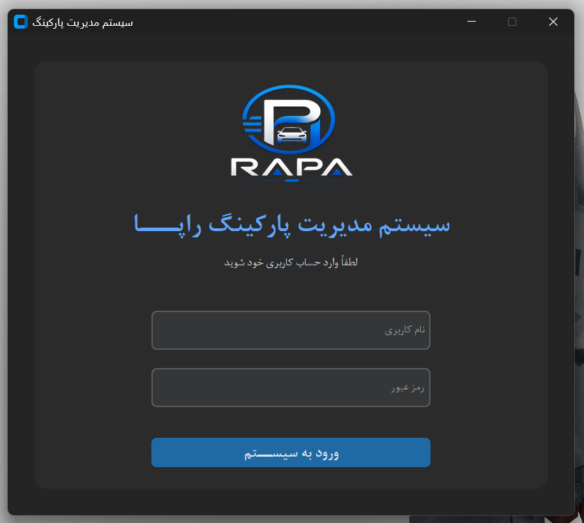
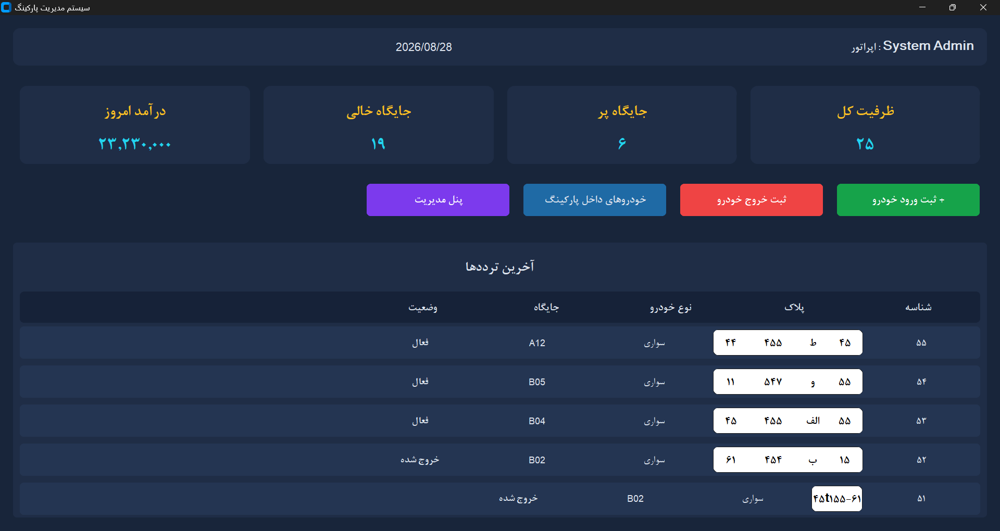
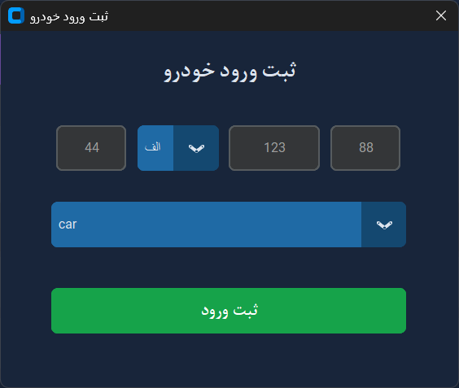
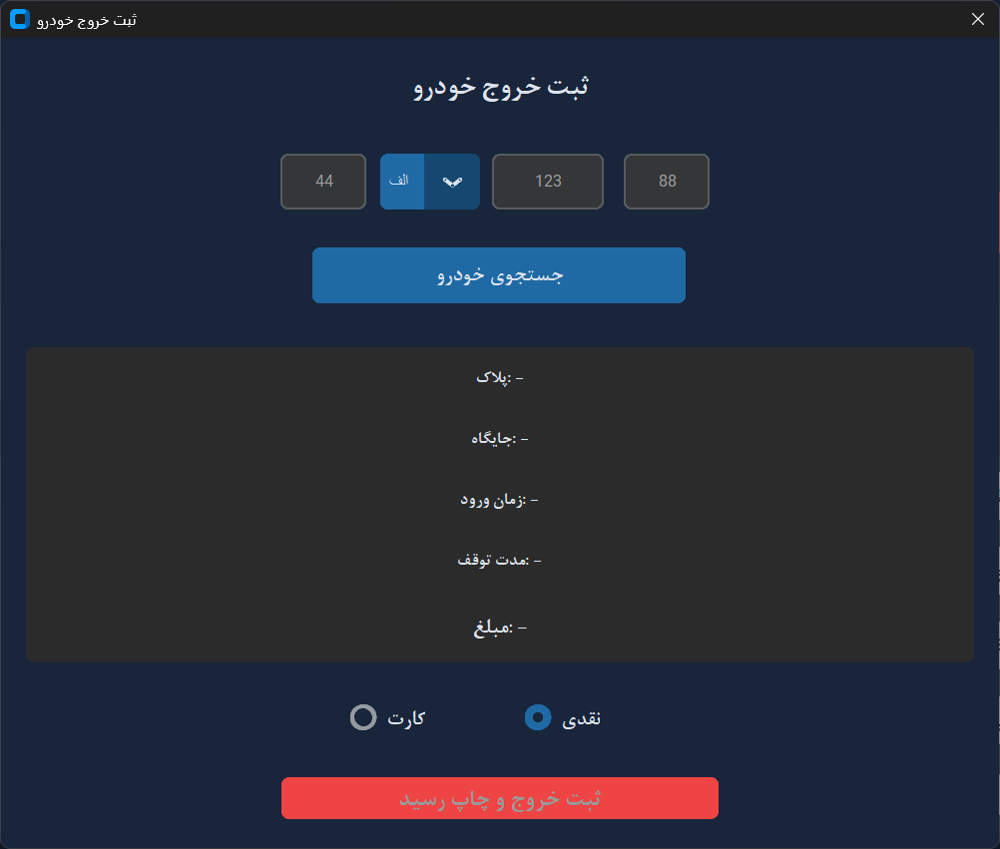
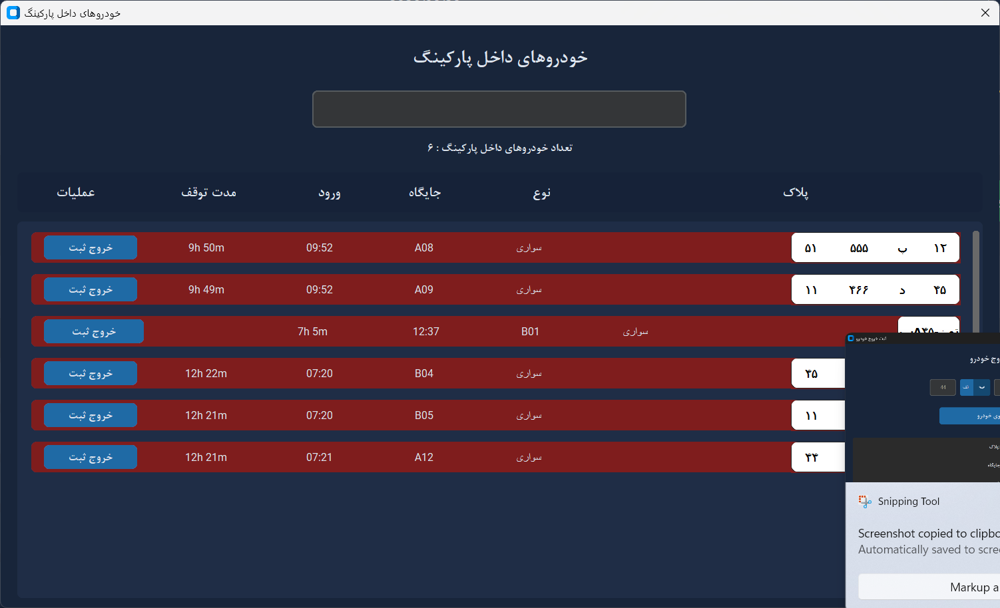
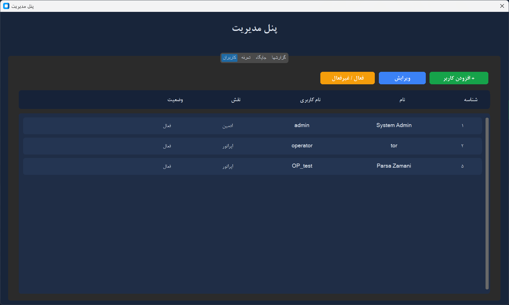

# Parking Management System

A desktop-based Parking Management System developed as a Software Engineering course project.

The system provides a complete workflow for managing a parking facility, including user authentication, vehicle entry and exit, parking spots, tariffs, parking sessions, payments, receipts, active vehicles, and administrative operations.

The project is structured using a layered architecture inspired by **Clean Architecture**, separating the domain logic, application logic, infrastructure, and user interface.

---

## Features

### Authentication & User Management

- User login and authentication
- Role-based access for system users
- User creation and management
- User information update
- User management through the administration panel

### Vehicle Management

- Register vehicle entry
- Register vehicle exit
- Support for different vehicle types
- License plate registration
- License plate conversion
- View vehicles currently inside the parking

### Parking Spot Management

- Create parking spots
- Update parking spot information
- Delete parking spots
- Enable and disable parking spots
- Track parking spot status and availability

### Tariff Management

- Create and manage parking tariffs
- Update tariff information
- Calculate parking fees according to configured tariffs

### Parking Sessions

- Create parking sessions when a vehicle enters
- Store vehicle, parking spot, and operator information
- Track entry and exit times
- Calculate the final parking fee
- Track session status

### Payments & Receipts

- Process parking payments
- Record payment information
- Generate parking receipts
- Generate receipt PDF files

### Dashboard & Reports

- Parking dashboard
- Display parking capacity information
- Display occupied and available spaces
- Display current revenue
- Display recent parking activity
- Access operational reports

### Desktop Interface

The project includes a desktop graphical interface with dedicated windows for:

- Login
- Dashboard
- Vehicle Entry
- Vehicle Exit
- Active Vehicles
- Administration Panel
- User Management
- Parking Spot Management

---

# Screenshots

The final application includes a graphical desktop interface for the main parking management operations.

## Login

The login screen allows users to authenticate before accessing the system.



---

## Dashboard

The dashboard provides an overview of the current state of the parking system, including parking capacity, occupied spaces, available spaces, revenue, and recent activity.



---

## Vehicle Entry

Operators can register an incoming vehicle by entering the license plate information and selecting the vehicle type.



---

## Vehicle Exit & Payment

The vehicle exit screen is used to register a vehicle's departure, calculate the parking fee, and complete the payment process.



---

## Active Vehicles

This section displays vehicles that are currently inside the parking facility.



---

## Administration Panels

The administration panel provides access to management functionality such as users, parking spots, tariffs, and other administrative operations.




---

# Architecture

The project is organized into several layers.

## Domain

The domain layer contains the core entities and domain-specific exceptions.

```text
src/domain/
├── entities/
│   ├── operator_shift.py
│   ├── parking.py
│   ├── parking_info.py
│   ├── parking_session.py
│   ├── parking_spot.py
│   ├── receipt.py
│   ├── tariff.py
│   ├── user.py
│   └── vehicle.py
│
└── exceptions.py
```

The domain layer represents the main business concepts of the system independently from the database and user interface.

---

## Application

The application layer contains repository interfaces, application services, and use cases.

```text
src/application/
├── interfaces/
│   ├── parking_repo.py
│   ├── receipt_repo.py
│   ├── session_repo.py
│   ├── shift_repo.py
│   ├── spot_repo.py
│   ├── tariff_repo.py
│   ├── user_repo.py
│   └── vehicle_repo.py
│
├── services/
│   ├── auth_service.py
│   └── fee_calculator.py
│
└── use_cases/
    ├── admin_panel_usecase.py
    ├── create_parking_spot_usecase.py
    ├── create_user_usecase.py
    ├── dashboard_usecase.py
    ├── delete_parking_spot_usecase.py
    ├── issue_receipt.py
    ├── list_active_vehicles.py
    ├── manage_tariffs.py
    ├── manage_users.py
    ├── register_entry.py
    ├── register_exit.py
    ├── register_exit_usecase.py
    ├── reports.py
    ├── show_active_vehicles.py
    ├── toggle_parking_spot_usecase.py
    ├── update_parking_spot_usecase.py
    ├── update_tariff_usecase.py
    └── update_user_usecase.py
```

---

## Infrastructure

The infrastructure layer contains the database connection, migrations, and concrete repository implementations.

```text
src/infrastructure/
├── db/
│   ├── connection.py
│   └── migrations.py
│
└── repositories/
    ├── parking_repo_sqlite.py
    ├── receipt_repo_sqlite.py
    ├── session_repo_sqlite.py
    ├── shift_repo_sqlite.py
    ├── spot_repo_sqlite.py
    ├── tariff_repo_sqlite.py
    ├── user_repo_sqlite.py
    └── vehicle_repo_sqlite.py
```

---

## User Interface

The project provides both a desktop interface and a CLI interface.

```text
src/ui/
├── assets/
│   ├── fonts/
│   │   └── BNazanin.ttf
│   ├── logo.png
│   └── logo1.png
│
├── cli/
│   └── app.py
│
└── desktop/
    ├── active_vehicles_window.py
    ├── add_parking_spot_window.py
    ├── add_user_window.py
    ├── admin_panel_window.py
    ├── dashboard_window.py
    ├── login_window.py
    ├── register_entry_window.py
    └── register_exit_window.py
```

---

# Project Structure

```text
parking-management-system/
│
├── README.md
├── .gitignore
├── requirements.txt
├── run.py
│
├── data/
│   ├── parking.db
│   ├── schema.sql
│   └── seed.sql
│
├── docs/
│   ├── .gitkeep
│   ├── DB_implementation_HW05_Parsa_Raef.pdf
│   ├── Parking_Management_User_Forms_and_Flow_Raef_Parsa.pdf
│   ├── SE_ClassDiagram.svg
│   ├── SE_Use-Case.svg
│   └── screenshots/
│       ├── login.png
│       ├── dashboard.png
│       ├── vehicle-entry.png
│       ├── vehicle-exit.png
│       ├── active-vehicles.png
│       ├── admin-panel.png
│       ├── parking-spots.png
│       └── user-management.png
│
├── src/
│   ├── application/
│   │   ├── interfaces/
│   │   ├── services/
│   │   └── use_cases/
│   │
│   ├── config/
│   │
│   ├── domain/
│   │   ├── entities/
│   │   └── exceptions.py
│   │
│   ├── infrastructure/
│   │   ├── db/
│   │   └── repositories/
│   │
│   ├── ui/
│   │   ├── assets/
│   │   ├── cli/
│   │   └── desktop/
│   │
│   └── utils/
│
└── test/
    ├── test_connection.py
    └── domain/
```

---

# Database

The system uses **SQLite** as its database.

Database-related files are stored in the `data/` directory:

```text
data/
├── parking.db
├── schema.sql
└── seed.sql
```

### Database Files

- `parking.db` — SQLite database used by the application
- `schema.sql` — Database schema and table definitions
- `seed.sql` — Initial database data

The application communicates with the database through the infrastructure layer and repository implementations.

---

# Documentation

Additional project documentation is available in the `docs/` directory.

### Class Diagram

[SE_ClassDiagram.svg](docs/SE_ClassDiagram.svg)

### Use Case Diagram

[SE_Use-Case.svg](docs/SE_Use-Case.svg)

### Database Implementation

[DB_implementation_HW05_Parsa_Raef.pdf](docs/DB_implementation_HW05_Parsa_Raef.pdf)

### User Forms and Flow

[Parking_Management_User_Forms_and_Flow_Raef_Parsa.pdf](docs/Parking_Management_User_Forms_and_Flow_Raef_Parsa.pdf)

---

# Testing

The project includes tests for the database connection and core domain entities.

```text
test/
├── test_connection.py
└── domain/
    ├── test_operator_shift.py
    ├── test_parking_session.py
    ├── test_parking_spot.py
    ├── test_receipt.py
    ├── test_tariff.py
    ├── test_user.py
    └── test_vehicle.py
```

---

# Requirements

The project requires:

- Python 3.x
- SQLite
- Python packages listed in `requirements.txt`

---

# Installation

Clone the repository:

```bash
git clone https://github.com/parsazamani1383/parking-management-system-main.git
cd parking-management-system-main
```

Create a virtual environment:

```bash
python -m venv .venv
```

### Windows

```bash
.venv\Scripts\activate
```

### Linux / macOS

```bash
source .venv/bin/activate
```

Install the required dependencies:

```bash
pip install -r requirements.txt
```

---

# Running the Application

Run the main application using:

```bash
python run.py
```

---

# Utilities

The project also includes utility modules for:

- License plate conversion
- Receipt PDF generation

```text
src/utils/
├── plate_converter.py
└── receipt_pdf.py
```

---

# Technologies

- Python
- SQLite
- Object-Oriented Programming
- Clean Architecture principles
- Repository Pattern
- Unit Testing
- PDF Receipt Generation

---

# Course Project

This project was developed as part of a **Software Engineering course**.

## Team

- **Parsa Zamani**
- **Raef Zandkarimi**

---

# Repository

GitHub Repository:

https://github.com/parsazamani1383/parking-management-system-main
```
